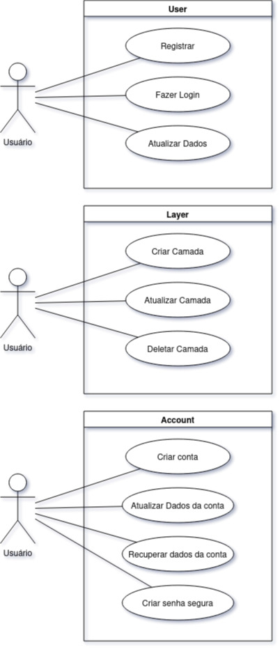

# Keyatror

## Introdução

Keyatror é uma aplicação Laravel desenvolvida como projeto integrador para fins educativos na faculdade. O objetivo deste projeto é criar um gerenciador de senhas, permitindo que os usuários armazenem e gerenciem suas senhas de forma segura.

## Objetivos

- Gerar senhas seguras para o Usuário
- Gerenciar senhas de forma segura.
- Facilitar o acesso e a organização de senhas pelos usuários.

## Diagramas

### Diagrama de Classes


### Diagrama de Use Case



## Funcionalidades

- Cadastro de usuários
- Autenticação de usuários
- Armazenamento seguro de senhas
- Organização de senhas em categorias
- Recuperação de senhas esquecidas
- Atualização de informações de usuário

## Rotas

As principais rotas da aplicação são:

- `GET /` - Página inicial
- `GET /login` - Página de login
- `POST /login` - Autenticação de usuário
- `GET /register` - Página de registro
- `POST /register` - Criação de novo usuário
- `GET /passwords` - Listagem de senhas
- `POST /passwords` - Criação de nova senha
- `GET /passwords/{id}` - Visualização de detalhes da senha
- `PUT /passwords/{id}` - Atualização de senha
- `DELETE /passwords/{id}` - Exclusão de senha

## Requisitos

- PHP >= 7.3
- Composer
- Banco de dados (MySQL, PostgreSQL, etc.)
- Node.js e npm

## Instalação

### Clonar o Repositório

```bash
git clone https://github.com/JoaoOtavioCastro/Keyatror.git
cd Keyatror
```

### Instalar Dependências


```bash
composer install
npm install
npm run dev
```

### Configuração Arquivo .env

#### Copie o arquivo de exemplo .env.example para .env e configure suas variáveis de ambiente:

```bash
cp .env.example .env
php artisan key:generate
```
#### Edite o arquivo .env para configurar a conexão com o banco de dados e outras variáveis de ambiente:

```
DB_CONNECTION=mysql
DB_HOST=127.0.0.1
DB_PORT=3306
DB_DATABASE=nome_do_banco
DB_USERNAME=seu_usuario
DB_PASSWORD=sua_senha
```
### Migrações

```bash
php artisan migrate
```
### Servidor de Desenvolvimento

```bash
php artisan serve
```